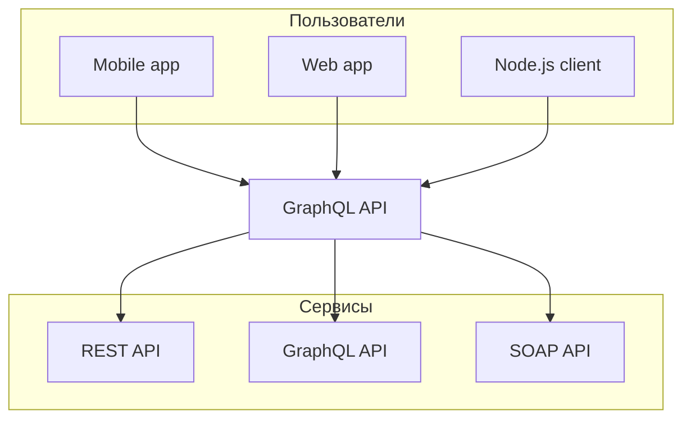

# Mermaid

Nextra поддерживает диаграммы [mermaid](https://mermaid.js.org). Как и на GitHub в своих markdown файлах вы можете использовать блоки с кодом `mermaid`. Из коробки Nextra применяет пакет [`@theguild/remark-mermaid`](https://npmjs.com/package/@theguild/remark-mermaid), который заменяет соответствующий блок кода на компонент `<Mermaid />`.

## Пример



## Использование

````mdx filename="Markdown"

````