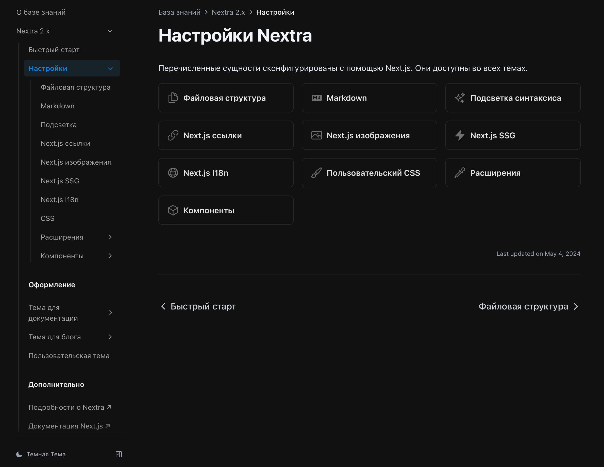

import { Cards } from 'nextra/components'

# Перевод документации Nextra

## Идея

Для этого сайта я выбрал фреймворк [Nextra](https://nextra.site). Он позволяет довольно быстро развернуть в сети базу знаний с документацией. В его основе применяется фреймворк Next.js, который мне близок. При этом у него есть неплохая документация.

Однако, [официальная документация](https://nextra.site/docs) по Nextra доступна только на английском языке, что может стать камнем преткновения для русскоязычных пользователей. Я решил устранить это препятствие.

## Задача

Перевести официальную документацию Nextra на русский язык.

## Реализация

Одновременно с созданием этого сайта я приступил к переводу. Ранее подобным не занимался, поэтому это был для меня интересный опыт. Не скажу, что свободно владею английским языком, но общий смысл технических текстов улавливаю. А с помощью Яндекс Переводчика эта затея оказалась вполне выполнимой. 

Конечно, переводил я не дословно. Старался передать содержание по смыслу, одновременно проверяя описанные возможности на этом сайте. В итоге получилось так, как получилось. 

Время от времени я возвращаюсь к переводу, когда мне требуется реализовать очередную фичу, и, если нахожу неточности, то сразу исправляю.

## Результат

Перевод доступен в разделе "База знаний":

<Cards num={2}>
  <Cards.Card image arrow title="Перейти к документации" href="../../knowledge-base/nextra/"
  >
    <></>
  </Cards.Card>
</Cards>

В будущем планирую связаться с разработчиками Nextra. Попробую договориться с ними об официальной локализации Nextra на русский язык. В декабре 2023 г. они заявили, что разрабатывают третью версию фреймворка, поэтому пока жду релиза.

## Общественная польза

Надеюсь, что мой перевод поможет русскоязычным пользователям быстро освоить фреймворк Nextra для развертывания их собственной документации в сети.

 

*[В начало страницы](#top-of-page)* 🔝