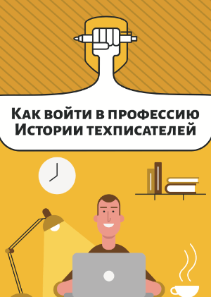
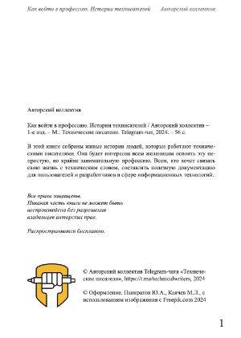
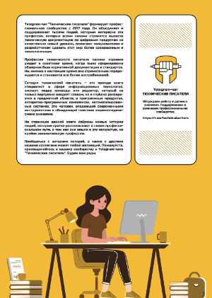

import { Steps } from 'nextra/components'

# Оформление сборника историй техписателей

<Steps>

### Идея

В феврале 2024 г. некоторые участники Телеграм-чата ["Технические писатели" ↗](https://t.me/technicalwriters) поделились своими историями. Рассказали, как они вошли в профессию, с какими трудностями столкнулись. Всего набралось 34 истории. В общей переписке коллеги поддержали идею объединить свои истории в сборник.

Не долго думая, я взял на себя эту инициативу. Пообещал все сделать "под ключ".

### Задача

Создать сборник историй техписателей в формате pdf. Оформление должно быть похожим на книгу, включая обложку, описание и выходные данные. 

### Реализация

На profi.ru я нашел дизайнера-верстальщика, с которым приступил к творческому процессу.  
Мои действия:

- формулирование и постановка задачи;
- взаимодействие с дизайнером-верстальщиком;
- написание текстов для оформления сборника;
- редактура и контроль за исполением;
- сдача-приемка результата и проведение взаиморасчетов.

### Результат

- Сборник историй техписателей можно ([скачать в pdf ↗](https://drive.google.com/file/d/1GzAso9jzsB1LJcJe6JAudysKtQkNdEOg/view?usp=share_link));
- Скриншоты:

	

	

	

### Общественная польза

Профессиональное сообщество весьма дружелюбно отреагировало на результат. Сборник понравился людям, чему свидетельствуют многочисленные лайки и благодарности от коллег, написавших мне лично. Положительные эмоции общественно полезны! 😄

</Steps>

*[В начало страницы](#top-of-page)* 🔝