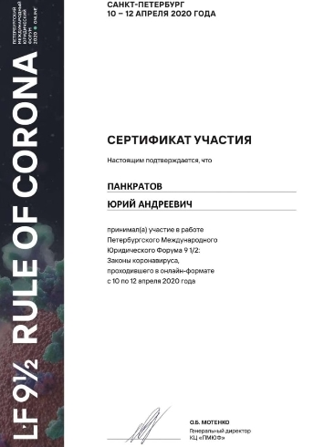
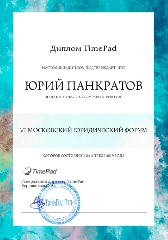
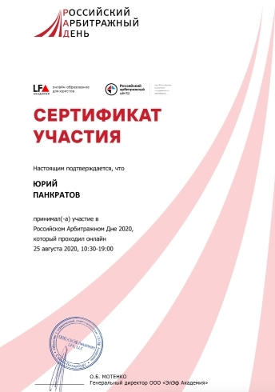
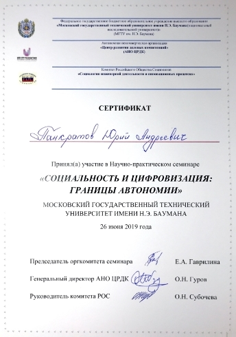
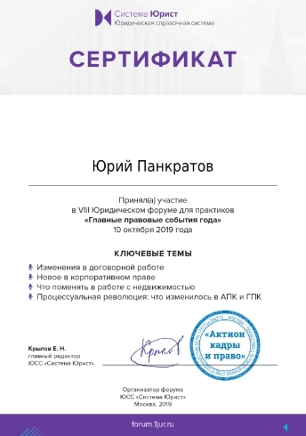

import { Cards, Steps } from 'nextra/components'

# Участие в общественных мероприятиях

В 2017-2020 гг. я активно участвовал в научно-просветительских мероприятиях, в том числе выступал и помогал в организации их проведения. Тому есть несколько подтверждений (на самом деле подобных "картинок" у меня гораздо больша. Но, думаю, этого будет вполне достаточно):

	

	

	

	

	

	

	

	

	

